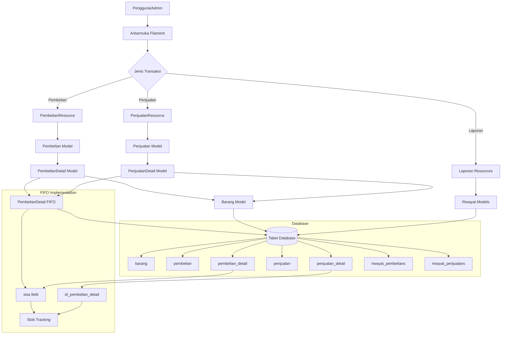

# Sistem Retail dengan Metode FIFO - Arsitektur Sistem

## Diagram Arsitektur Sistem

## Komponen Utama Sistem

### 1. Model Data

#### Barang (App\Models\Barang)
- Mewakili produk/item dalam inventaris
- Menyimpan stok total saat ini
- Terhubung dengan kategori dan detail transaksi

#### Pembelian (App\Models\Pembelian)
- Header transaksi pembelian
- Berisi tanggal pembelian

#### PembelianDetail (App\Models\PembelianDetail)
- Detail item dalam transaksi pembelian
- Menyimpan jumlah pembelian dan sisa stok (untuk FIFO)
- Field `sisa` digunakan untuk melacak berapa banyak item yang masih tersedia dari batch pembelian ini

#### Penjualan (App\Models\Penjualan)
- Header transaksi penjualan
- Berisi tanggal penjualan dan informasi pelanggan

#### PenjualanDetail (App\Models\PenjualanDetail)
- Detail item dalam transaksi penjualan
- Mengacu pada PembelianDetail tertentu (implementasi FIFO)
- Field `id_pembelian_detail` menunjukkan batch pembelian mana yang digunakan

### 2. Implementasi FIFO

Metode FIFO (First In, First Out) diimplementasikan melalui:

1. **PembelianDetail.sisa**: Melacak berapa banyak item yang masih tersedia dari setiap batch pembelian
2. **PenjualanDetail.id_pembelian_detail**: Menunjukkan batch pembelian mana yang digunakan untuk penjualan ini
3. **Algoritma FIFO**: Saat membuat penjualan, sistem:
   - Mengambil batch pembelian berdasarkan tanggal (paling awal dulu)
   - Mengurangi stok dari batch yang paling lama tersedia
   - Memperbarui field `sisa` di PembelianDetail
   - Mengupdate stok total di Barang

### 3. Alur Kerja Utama

#### Alur Pembelian
1. Admin mencatat pembelian baru melalui PembelianResource
2. Sistem membuat record di tabel `pembelian` dan `pembelian_detail`
3. Field `sisa` di PembelianDetail diatur sama dengan jumlah pembelian
4. Stok total di Barang diperbarui
5. Riwayat pembelian dicatat di `riwayat_pembelians`

#### Alur Penjualan (dengan FIFO)
1. Admin mencatat penjualan baru melalui PenjualanResource
2. Sistem memeriksa ketersediaan stok berdasarkan field `sisa` di PembelianDetail
3. Saat menyimpan penjualan, sistem:
   - Mengambil batch pembelian berdasarkan tanggal (paling awal dulu)
   - Mengurangi stok dari batch yang paling lama tersedia
   - Memperbarui field `sisa` di PembelianDetail
   - Mengupdate stok total di Barang
   - Mencatat referensi ke batch pembelian di PenjualanDetail
   - Membuat riwayat penjualan di `riwayat_penjualans`

#### Alur Penghapusan Penjualan
1. Saat penjualan dihapus, sistem:
   - Mengembalikan stok ke PembelianDetail yang sesuai
   - Mengembalikan stok total di Barang
   - Menghapus riwayat penjualan terkait

### 4. Laporan

#### Laporan Stok
- Menampilkan detail stok berdasarkan batch pembelian
- Menunjukkan tanggal pembelian, stok awal, dan sisa stok
- Menggunakan PembelianDetail sebagai sumber data

#### Laporan Penjualan
- Menampilkan riwayat penjualan
- Menggunakan RiwayatPenjualan sebagai sumber data
